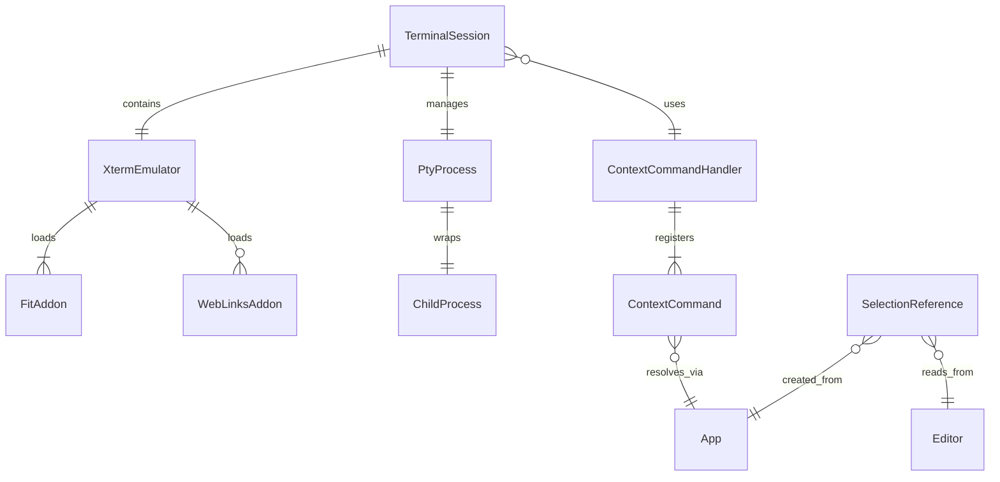

# Data Model: AI Terminal Integration

**Date**: 2025-12-22  
**Feature**: AI Terminal Integration  
**Source**: Extracted from [spec.md](./spec.md) and [research.md](./research.md)

---

## 概述

本文件定義 AI Terminal Integration 功能的資料模型，包括實體（Entities）、屬性（Attributes）、關係（Relationships）、狀態轉換（State Transitions）與驗證規則（Validation Rules）。

資料模型設計基於以下原則：
- **無狀態持久化**：終端狀態僅存於記憶體，關閉即清除（Phase 1）
- **最小資料結構**：避免過度設計，聚焦 MVP 必要屬性
- **型別安全**：所有實體使用 TypeScript 介面定義
- **明確生命週期**：每個實體的建立、更新、銷毀邏輯清晰

---

## 核心實體（Core Entities）

### 1. TerminalSession（終端連線會話）

**用途**：代表一個完整的終端連線實例，管理 xterm.js、PTY 進程、資料流、生命週期。

**屬性**：

```typescript
interface TerminalSession {
  // === 識別與狀態 ===
  id: string;                          // 唯一識別碼（UUID）
  status: TerminalStatus;              // 連線狀態
  createdAt: Date;                     // 建立時間
  
  // === 終端配置 ===
  cwd: string;                         // 工作目錄（絕對路徑）
  shell: string;                       // Shell 執行檔路徑（如 /bin/zsh）
  env: Record<string, string>;         // 環境變數
  
  // === 元件參考 ===
  emulator: XtermEmulator;             // xterm.js 封裝實例
  pty: PtyProcess;                     // PTY 進程參考
  
  // === 統計資訊 ===
  stats: {
    bytesWritten: number;              // 已寫入字節數
    bytesRead: number;                 // 已讀取字節數
    commandCount: number;              // 執行命令次數
  };
}

enum TerminalStatus {
  INITIALIZING = 'initializing',      // 初始化中
  RUNNING = 'running',                 // 運作中
  SUSPENDED = 'suspended',             // 暫停（未使用，保留）
  EXITED = 'exited',                   // 已退出
  ERROR = 'error'                      // 錯誤狀態
}
```

**驗證規則**：
- `id` 必須唯一（使用 UUID v4）
- `cwd` 必須為有效的系統絕對路徑
- `shell` 必須為可執行檔案路徑
- `status` 轉換必須遵循狀態機規則（見下方）

**狀態轉換**：
```
[建立] → INITIALIZING → RUNNING → EXITED
                      ↓
                    ERROR
```

**生命週期**：
1. **建立**：`PtyManager.create()` → 分配 id、初始化 emulator 與 pty
2. **運作**：接收使用者輸入、輸出 shell 回應、上下文指令替換
3. **暫停**：（Phase 1 不支援）
4. **銷毀**：`session.dispose()` → 釋放 emulator、終止 pty 進程、清除事件監聽器

---

### 2. XtermEmulator（xterm.js 封裝）

**用途**：封裝 xterm.js Terminal 實例與必要 addons，提供統一的終端 UI 介面。

**屬性**：

```typescript
interface XtermEmulator {
  // === 核心元件 ===
  terminal: Terminal;                  // xterm.js Terminal 實例
  
  // === Addons ===
  addons: {
    fit: FitAddon;                     // 自動調整大小
    webLinks?: WebLinksAddon;          // URL 檢測（可選）
    serialize?: SerializeAddon;        // 狀態序列化（Phase 3）
  };
  
  // === DOM 參考 ===
  container: HTMLElement;              // 終端容器元素
  
  // === 配置 ===
  options: ITerminalOptions;           // xterm.js 配置選項
}

interface ITerminalOptions {
  fontFamily: string;                  // 字體（預設：'Fira Code', monospace）
  fontSize: number;                    // 字體大小（預設：14）
  theme: ITheme;                       // 顏色主題（使用 Obsidian CSS 變數）
  cursorBlink: boolean;                // 游標閃爍（預設：true）
  scrollback: number;                  // 緩衝區行數（預設：1000）
  allowProposedApi: boolean;           // 啟用實驗性 API（預設：true）
}
```

**驗證規則**：
- `container` 必須為有效的 HTMLElement
- `fontSize` 範圍：12-20
- `scrollback` 範圍：100-10000

**生命週期**：
1. **建立**：`new XtermEmulator(container, options)` → 初始化 terminal、載入 addons、附加到 DOM
2. **調整大小**：監聽容器 ResizeObserver → 調用 `fitAddon.fit()`
3. **銷毀**：`emulator.dispose()` → 調用 `terminal.dispose()`、清除事件監聽器

---

### 3. PtyProcess（PTY 進程）

**用途**：代表一個 Python PTY 腳本啟動的 shell 進程，處理命令執行與輸入輸出。

**屬性**：

```typescript
interface PtyProcess {
  // === 進程資訊 ===
  pid: number;                         // 進程 ID
  shell: string;                       // Shell 路徑（如 /bin/zsh）
  cwd: string;                         // 工作目錄
  
  // === Python 腳本參考 ===
  pythonProcess: ChildProcess;         // Node.js child_process 實例
  pythonExecutable: string;            // Python 執行檔路徑（python3）
  ptyScript: string;                   // PTY 腳本路徑（unix_pty.py 或 windows_pty.py）
  
  // === 資料流 ===
  stdin: Writable;                     // 標準輸入（寫入命令）
  stdout: Readable;                    // 標準輸出（讀取結果）
  stderr: Readable;                    // 標準錯誤（讀取錯誤）
  
  // === 狀態 ===
  exitCode: number | null;             // 退出碼（null = 運作中）
}
```

**驗證規則**：
- `pid` 必須 > 0
- `cwd` 必須為存在的目錄路徑
- `shell` 必須為可執行檔案

**狀態轉換**：
```
[啟動] → Running (exitCode = null) → Exited (exitCode = number)
```

**生命週期**：
1. **啟動**：`childProcess.spawn(pythonExecutable, [ptyScript, shell], { cwd })` → 分配 pid
2. **運作**：接收 stdin 寫入、發出 stdout/stderr 事件
3. **退出**：進程結束 → 設定 exitCode、觸發 `onExit` 事件

---

### 4. ContextCommand（上下文指令）

**用途**：特殊的指令關鍵字（如 `@cfile`、`@folder`），在執行時替換為實際的 Obsidian 上下文資訊。

**屬性**：

```typescript
interface ContextCommand {
  // === 識別 ===
  keyword: string;                     // 關鍵字（如 '@cfile'）
  
  // === 行為 ===
  resolver: ContextResolver;           // 解析器函數
  description: string;                 // 說明文字（用於文件/提示）
  
  // === 配置 ===
  enabled: boolean;                    // 是否啟用（預設：true）
  caseSensitive: boolean;              // 大小寫敏感（預設：true）
}

type ContextResolver = (app: App) => Promise<string>;

// 內建上下文指令
const builtinCommands: ContextCommand[] = [
  {
    keyword: '@cfile',
    resolver: async (app) => {
      const file = app.workspace.getActiveFile();
      if (!file) throw new Error('目前沒有開啟的檔案');
      const adapter = app.vault.adapter as FileSystemAdapter;
      return adapter.getFullPath(file.path);
    },
    description: '當前開啟檔案的完整路徑',
    enabled: true,
    caseSensitive: true,
  },
  {
    keyword: '@folder',
    resolver: async (app) => {
      const adapter = app.vault.adapter as FileSystemAdapter;
      return adapter.getBasePath();
    },
    description: 'Vault 根目錄路徑',
    enabled: true,
    caseSensitive: true,
  },
];
```

**驗證規則**：
- `keyword` 不得為空字串
- `keyword` 不得包含空白字元
- `keyword` 在已註冊指令中必須唯一
- `resolver` 必須返回字串或拋出錯誤

**處理流程**：
```
[使用者輸入] → 偵測 Enter 鍵 → 檢查包含 @keyword
  → 調用 resolver(app) → 取得實際值
  → 路徑轉義 → 替換原始指令 → 傳送給 PTY
```

---

### 5. SelectionReference（選取範圍參考）

**用途**：編輯器中選取範圍的結構化表示，用於產生 GitHub 風格的檔案引用（`file.md#L10-L15`）。

**屬性**：

```typescript
interface SelectionReference {
  // === 檔案資訊 ===
  file: string;                        // 檔案 vault 相對路徑
  filePath: string;                    // 檔案系統絕對路徑
  
  // === 選取範圍 ===
  startLine: number;                   // 起始行號（1-indexed）
  endLine: number;                     // 結束行號（1-indexed）
  startCol: number;                    // 起始列號（0-indexed）
  endCol: number;                      // 結束列號（0-indexed）
  
  // === 內容 ===
  text: string;                        // 選取的文字內容
  
  // === 格式化 ===
  formatted: string;                   // GitHub 風格引用（file.md#L10-L15）
}
```

**驗證規則**：
- `startLine` ≤ `endLine`
- `startLine`, `endLine` ≥ 1
- `startCol`, `endCol` ≥ 0
- `file` 必須為有效的 vault 路徑

**格式化規則**：
```typescript
// 單行選取
file.md#L10

// 多行選取
file.md#L10-L15

// 完整路徑版本（用於終端）
/absolute/path/to/file.md#L10-L15
```

**生命週期**：
1. **建立**：使用者執行「複製選取範圍參考」命令 → 從 Editor API 取得選取資訊
2. **格式化**：產生 GitHub 風格字串
3. **顯示**：通知訊息展示、點擊複製到剪貼簿
4. **銷毀**：通知關閉後即釋放

---

## 關係圖（Relationships）



**關係說明**：

| 關係 | 類型 | 說明 |
|------|------|------|
| TerminalSession → XtermEmulator | 組合（1:1） | 每個 session 包含一個 emulator 實例 |
| TerminalSession → PtyProcess | 組合（1:1） | 每個 session 管理一個 pty 進程 |
| TerminalSession → ContextCommandHandler | 使用（N:1） | 多個 session 共用一個 handler 實例 |
| XtermEmulator → Addons | 組合（1:N） | emulator 載入多個 addons |
| PtyProcess → ChildProcess | 包裝（1:1） | pty 包裝一個 Node.js child_process |
| ContextCommandHandler → ContextCommand | 註冊（1:N） | handler 管理多個指令定義 |
| ContextCommand → App | 依賴（N:1） | resolver 需要 App 實例解析上下文 |
| SelectionReference → App/Editor | 依賴（N:1） | 從 App/Editor 讀取選取範圍資訊 |

---

## 資料流（Data Flow）

### 1. 使用者輸入流

```
[使用者輸入] 
  → XtermEmulator.terminal.onData(data)
  → ContextCommandHandler.handleInput(data)
    → 檢測 Enter 鍵？
      → 是：檢查 @keyword
        → 調用 ContextCommand.resolver(app)
        → 路徑轉義
        → 替換原始指令
      → 否：直接傳遞
  → PtyProcess.stdin.write(processedData)
  → Python PTY 腳本
  → Shell 執行
```

### 2. Shell 輸出流

```
[Shell 輸出]
  → Python PTY 腳本
  → PtyProcess.stdout.on('data', chunk)
  → XtermEmulator.terminal.write(chunk)
  → 渲染到 DOM
  → [使用者看到結果]
```

### 3. 選取範圍參考流

```
[使用者選取文字]
  → 執行「複製選取範圍參考」命令
  → SelectionReferenceHandler.getSelection()
    → Editor.getCursor('from/to')
    → 轉換行號（0-indexed → 1-indexed）
  → SelectionReferenceHandler.formatReference()
    → 產生 GitHub 風格字串
  → SelectionReferenceHandler.showReferenceNotice()
    → 顯示 Notice 通知
    → 使用者點擊
  → Clipboard.writeText(reference)
  → [複製完成]
```

---

## 狀態管理（State Management）

### TerminalSession 狀態機

```typescript
type TerminalStatus = 
  | 'initializing'  // 初始化中
  | 'running'       // 運作中
  | 'exited'        // 已退出
  | 'error';        // 錯誤狀態

// 狀態轉換規則
const transitions: Record<TerminalStatus, TerminalStatus[]> = {
  initializing: ['running', 'error'],
  running: ['exited', 'error'],
  exited: [],  // 終止狀態
  error: [],   // 終止狀態
};

// 狀態轉換函數
function transition(
  currentStatus: TerminalStatus,
  nextStatus: TerminalStatus
): boolean {
  return transitions[currentStatus].includes(nextStatus);
}
```

**狀態轉換事件**：

| 從 | 到 | 觸發事件 | 動作 |
|---|---|---------|------|
| - | `initializing` | `PtyManager.create()` | 建立 emulator、啟動 pty |
| `initializing` | `running` | `pty.onReady()` | 連接資料流、啟用輸入 |
| `initializing` | `error` | `pty.onError()` | 顯示錯誤訊息、清理資源 |
| `running` | `exited` | `pty.onExit(code)` | 顯示退出訊息、保持終端可見 |
| `running` | `error` | `pty.onError()` | 顯示錯誤訊息、清理資源 |

---

## 錯誤處理（Error Handling）

### 錯誤類型定義

```typescript
enum TerminalErrorCode {
  // === PTY 相關 ===
  PTY_SPAWN_FAILED = 'PTY_SPAWN_FAILED',           // PTY 啟動失敗
  PTY_WRITE_FAILED = 'PTY_WRITE_FAILED',           // 寫入失敗
  PTY_UNEXPECTED_EXIT = 'PTY_UNEXPECTED_EXIT',     // 意外退出
  
  // === 上下文指令相關 ===
  NO_ACTIVE_FILE = 'NO_ACTIVE_FILE',               // 無開啟檔案
  INVALID_PATH = 'INVALID_PATH',                   // 無效路徑
  CONTEXT_RESOLVE_FAILED = 'CONTEXT_RESOLVE_FAILED', // 上下文解析失敗
  
  // === 系統相關 ===
  PYTHON_NOT_FOUND = 'PYTHON_NOT_FOUND',           // Python 未安裝
  FILESYSTEM_ERROR = 'FILESYSTEM_ERROR',           // 檔案系統錯誤
  PERMISSION_DENIED = 'PERMISSION_DENIED',         // 權限不足
}

class TerminalError extends Error {
  constructor(
    public code: TerminalErrorCode,
    message: string,
    public originalError?: Error
  ) {
    super(message);
    this.name = 'TerminalError';
  }
}
```

**錯誤處理策略**：

| 錯誤類型 | 處理方式 | 使用者體驗 |
|---------|---------|-----------|
| `PTY_SPAWN_FAILED` | 顯示錯誤通知 + 安裝指引連結 | Notice: "終端啟動失敗：請確認 Python 已安裝" |
| `NO_ACTIVE_FILE` | 阻止指令執行 + 提示訊息 | 終端顯示：`錯誤：目前沒有開啟的檔案，無法替換 @cfile` |
| `PTY_UNEXPECTED_EXIT` | 顯示退出碼 + 保持終端可見 | 終端顯示：`[Process exited with code 1]` |
| `FILESYSTEM_ERROR` | 顯示錯誤 + 回退到 vault 根目錄 | Notice: "無法存取目錄，已切換至 vault 根目錄" |

---

## 序列化與持久化（Serialization & Persistence）

**Phase 1 策略**：無持久化，僅記憶體狀態

**Phase 3 規劃**（狀態持久化）：

```typescript
interface SerializedTerminalSession {
  // === 基本資訊 ===
  cwd: string;                         // 工作目錄
  shell: string;                       // Shell 路徑
  
  // === 終端內容 ===
  buffer: string;                      // 終端緩衝區內容（SerializeAddon）
  scrollPosition: number;              // 滾動位置
  
  // === 時間戳 ===
  lastActiveAt: Date;                  // 最後活躍時間
}

// 序列化（關閉前）
function serialize(session: TerminalSession): SerializedTerminalSession {
  return {
    cwd: session.cwd,
    shell: session.shell,
    buffer: session.emulator.addons.serialize.serialize(),
    scrollPosition: session.emulator.terminal.buffer.active.viewportY,
    lastActiveAt: new Date(),
  };
}

// 反序列化（Obsidian 重啟後）
async function deserialize(
  data: SerializedTerminalSession
): Promise<TerminalSession> {
  const session = await PtyManager.create({ cwd: data.cwd, shell: data.shell });
  
  // 恢復緩衝區內容（只讀）
  session.emulator.terminal.write(data.buffer);
  
  // 恢復滾動位置
  session.emulator.terminal.scrollToLine(data.scrollPosition);
  
  return session;
}
```

---

## 資料驗證（Data Validation）

### 路徑驗證

```typescript
function validatePath(path: string): { valid: boolean; error?: string } {
  // 1. 非空檢查
  if (!path || path.trim() === '') {
    return { valid: false, error: '路徑不得為空' };
  }
  
  // 2. 絕對路徑檢查（Unix: 以 / 開頭，Windows: 磁碟機代號）
  const isAbsolute = path.startsWith('/') || /^[A-Z]:\\/.test(path);
  if (!isAbsolute) {
    return { valid: false, error: '必須為絕對路徑' };
  }
  
  // 3. 存在性檢查（使用 fs.existsSync）
  if (!fs.existsSync(path)) {
    return { valid: false, error: '路徑不存在' };
  }
  
  // 4. 目錄檢查
  const stats = fs.statSync(path);
  if (!stats.isDirectory()) {
    return { valid: false, error: '路徑必須為目錄' };
  }
  
  return { valid: true };
}
```

### 上下文指令驗證

```typescript
function validateContextCommand(command: ContextCommand): string[] {
  const errors: string[] = [];
  
  // 1. 關鍵字格式
  if (!command.keyword || command.keyword.trim() === '') {
    errors.push('關鍵字不得為空');
  }
  
  if (command.keyword.includes(' ')) {
    errors.push('關鍵字不得包含空白字元');
  }
  
  // 2. Resolver 函數
  if (typeof command.resolver !== 'function') {
    errors.push('resolver 必須為函數');
  }
  
  // 3. 唯一性（與已註冊指令比對）
  if (isKeywordRegistered(command.keyword)) {
    errors.push(`關鍵字 "${command.keyword}" 已被註冊`);
  }
  
  return errors;
}
```

---

## 效能考量（Performance Considerations）

### 記憶體管理

| 實體 | 預估大小 | 數量限制 | 清理策略 |
|------|---------|---------|---------|
| `TerminalSession` | ~2MB（含 1000 行緩衝區） | 建議 ≤ 5 個實例 | onClose() 時立即釋放 |
| `XtermEmulator` | ~1MB | 與 TerminalSession 1:1 | dispose() 清除 DOM 與事件 |
| `PtyProcess` | ~500KB | 與 TerminalSession 1:1 | kill() 終止進程 |
| `SelectionReference` | ~1KB | 暫時性（使用後即釋放） | Notice 關閉後自動 GC |

### 緩衝區限制

```typescript
// xterm.js scrollback 配置
const terminal = new Terminal({
  scrollback: 1000,  // 限制 1000 行（約 100-200KB）
});

// 定期清理（如需要）
if (terminal.buffer.active.length > 10000) {
  terminal.clear();  // 清除顯示但保留 scrollback
}
```

### 資料流效能

```typescript
// 批次寫入（避免頻繁呼叫 terminal.write）
const writeQueue: string[] = [];

pty.stdout.on('data', (chunk: Buffer) => {
  writeQueue.push(chunk.toString());
});

// 每 16ms（60fps）批次寫入
setInterval(() => {
  if (writeQueue.length > 0) {
    terminal.write(writeQueue.join(''));
    writeQueue.length = 0;
  }
}, 16);
```

---

## 總結

**核心實體數量**：5 個主要實體（TerminalSession、XtermEmulator、PtyProcess、ContextCommand、SelectionReference）

**關係複雜度**：低至中等（主要為組合與使用關係，無多對多）

**狀態管理**：明確的狀態機設計（TerminalSession 4 種狀態）

**錯誤處理**：完整的錯誤類型定義與處理策略

**效能考量**：記憶體限制、緩衝區管理、批次寫入優化

**下一步**：Phase 1 contracts/ 生成（API 契約定義）
